# Patient Dashboard

## Overview

This project is built with React.js, TailwindCSS for the frontend, and Node.js with Express for the backend. The application provides a patient dashboard where patients can view their profile, interaction history with the chatbot, and linked doctor information. The project also includes session management to maintain the context of patient interactions and stores interaction histories in a database.

### Live Link

https://patient-dashboard-nty4.vercel.app/login

Frontend Hosted on Vercel
Backend Hosted on Render

### API Endpoints

#### Patient API

POST /api/auth/register : Create a new patient profile.
GET /api/auth/login : Patient Login.

#### Doctors API

POST /api/doctors/create : Create a new Doctor.
POST /api/patients/link-doctor : Link doctor to patient.
POST /api/interactions: Create Interaction with doctors.
GET /api/interactions: Get Interaction with doctors.

#### Chatbot API

POST /chat/send-message: Send message to Bot.
GET /chat/chat-history/:userId: GET chat history.

## Images
<br>
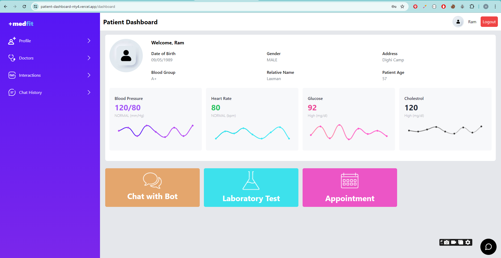
<br>
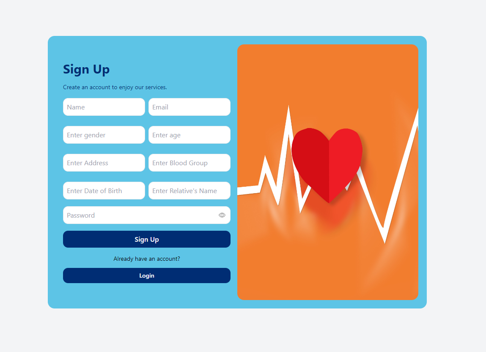
<br>
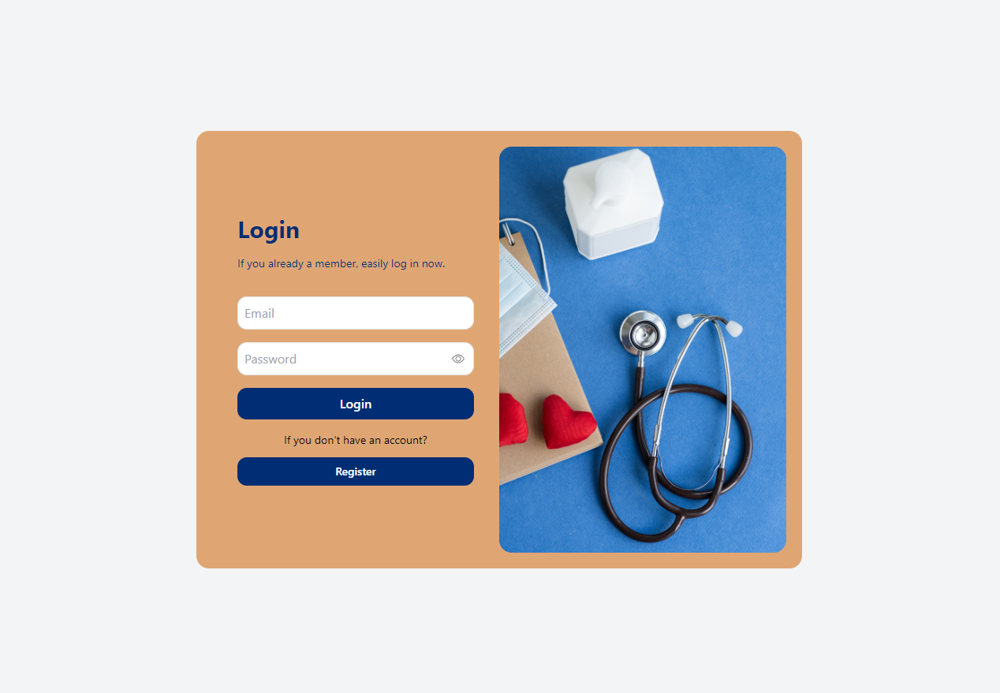
<br>
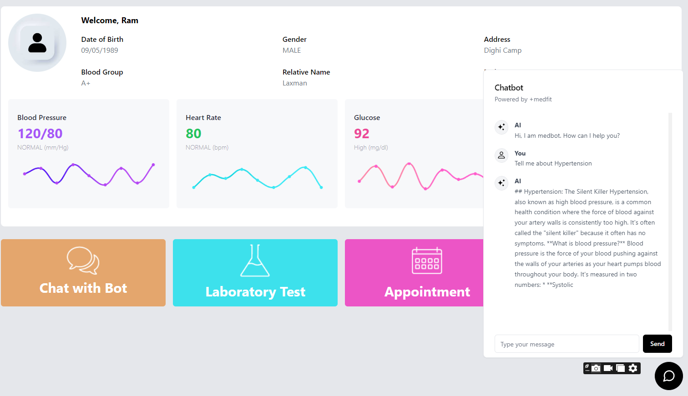
<br>
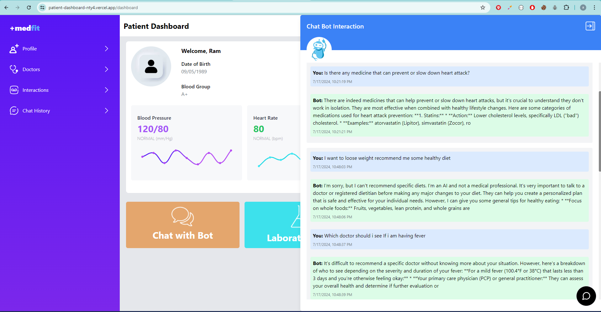
<br>
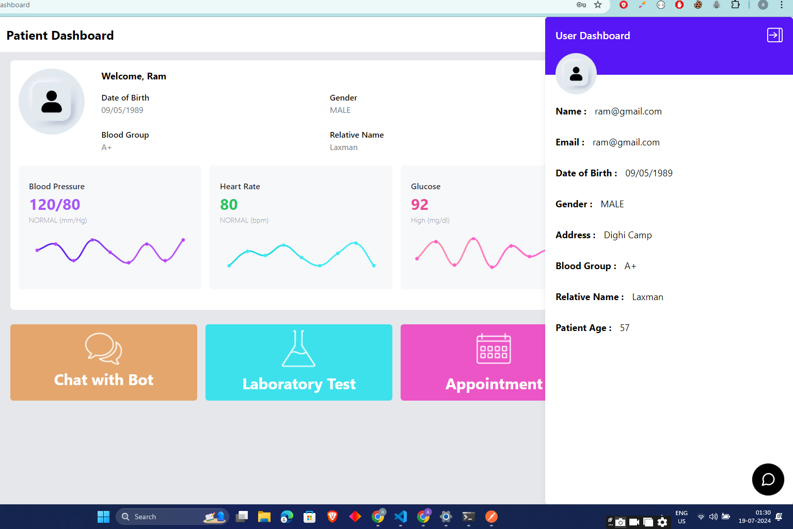
<br>
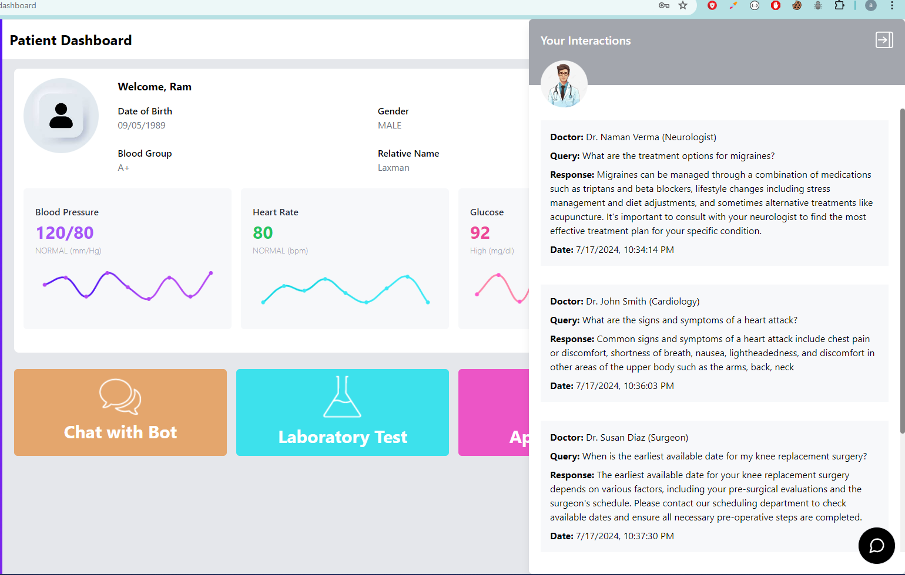
<br>
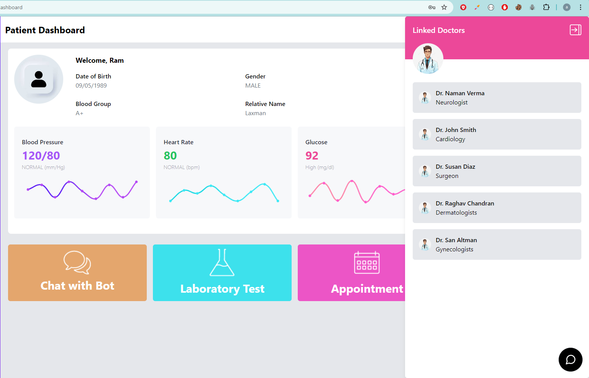
<br>
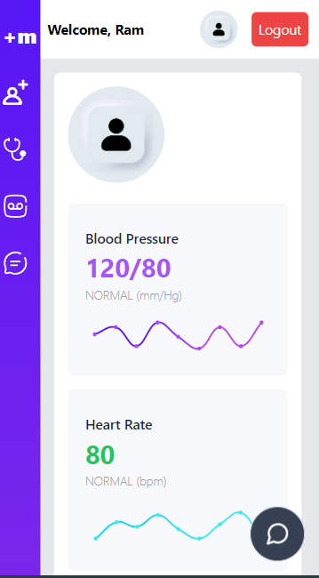
<br>
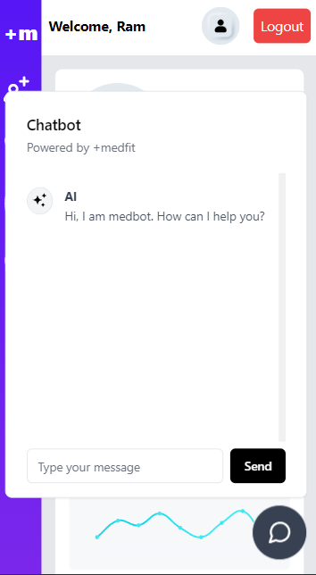
<br>
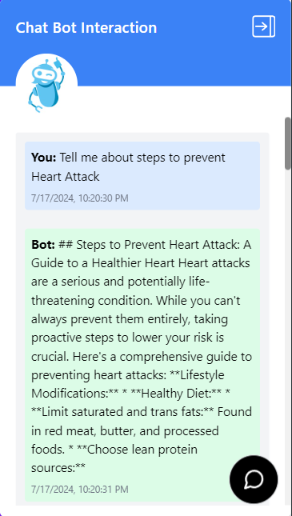
<br>


## Features

### Patient Dashboard:

- View patient profile, interaction history, and linked doctor information.
- Display a list of past interactions with the chatbot.
<br>

### Chatbot Interface:

- Embed a chatbot widget into the dashboard.
- Allow patients to submit text queries to the chatbot.
- Display the chatbot’s responses in real-time.

### Session Management:

- Implement session tracking to maintain the context of patient interactions.
- Store interaction histories in a database (MongoDB).

### Database Schema:

- Store patient profiles, interaction histories, and linked doctor information.
- Ensure efficient retrieval of past interactions and linked doctor details.

## Getting Started

Backend Setup
Clone the repository:

``` bash
git clone https://github.com/Akayush-17/Patient-Dashboard.git
cd backend

Install dependencies:

bash
Copy code
npm install

Set up environment variables:

Create a .env file in the backend directory.
Add the necessary environment variables (e.g., MongoDB connection strings, Gemini API keys, JWT_SECRET, SESSION_SECRET ).
Run the backend server:

bash
Copy code
npm run start

bash
Copy code
Frontend Setup
Navigate to the frontend directory:

bash
Copy code
cd patientdashboard
Install dependencies:

bash
Copy code
npm install
Run the frontend application:

bash
Copy code
npm start
```


## Documentation

### Patient Dashboard
- The patient dashboard allows patients to view their profile, interaction history, and linked doctor information.

### Features:
- Display patient profile information.
- Show a list of past interactions with the chatbot.
- Embed a chatbot widget for real-time text queries and responses.
- Chatbot Integration
- Embed a chatbot interface into the dashboard to allow patients to interact with the chatbot.

### Features:
- Submit text queries to the chatbot.
- Display chatbot responses in real-time.
- Store interaction history in the database.
- Session Management
- Implement session tracking to maintain the context of patient interactions and store interaction histories.

### Features:
- Create and manage sessions for patient interactions.
- Store session data and interaction histories in a database.
- Retrieve past interactions and maintain session context.
- Database Schema
- Design a database schema to store patient profiles, interaction histories, and linked doctor information.

### Features:
- Efficiently store and retrieve patient profiles.
- Maintain a history of interactions with the chatbot.
- Link doctor information to patient profiles.
- This documentation provides an overview of the Patient Dashboard project, including setup instructions, features, and API endpoints. For further details, refer to the code and comments within the repository.


